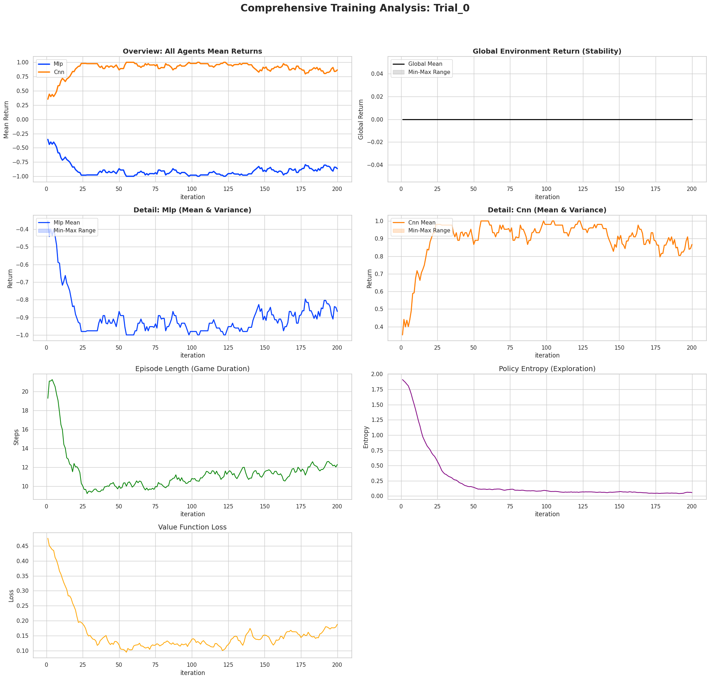
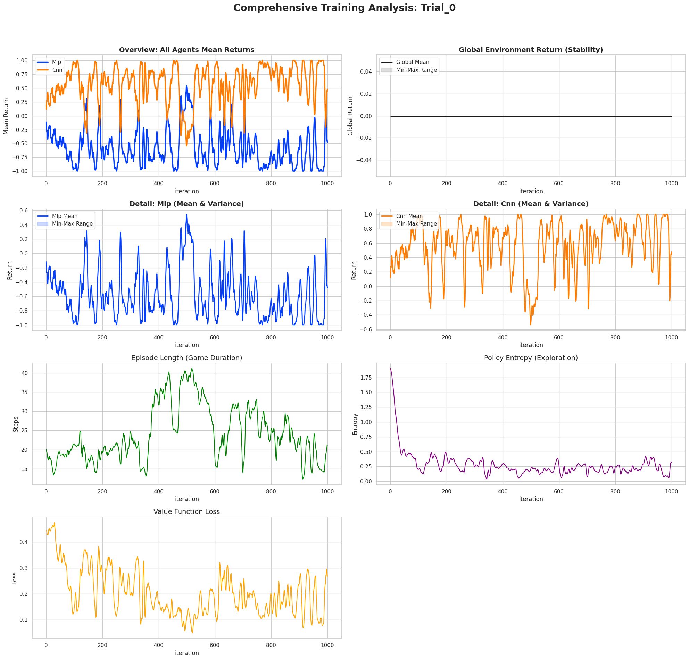
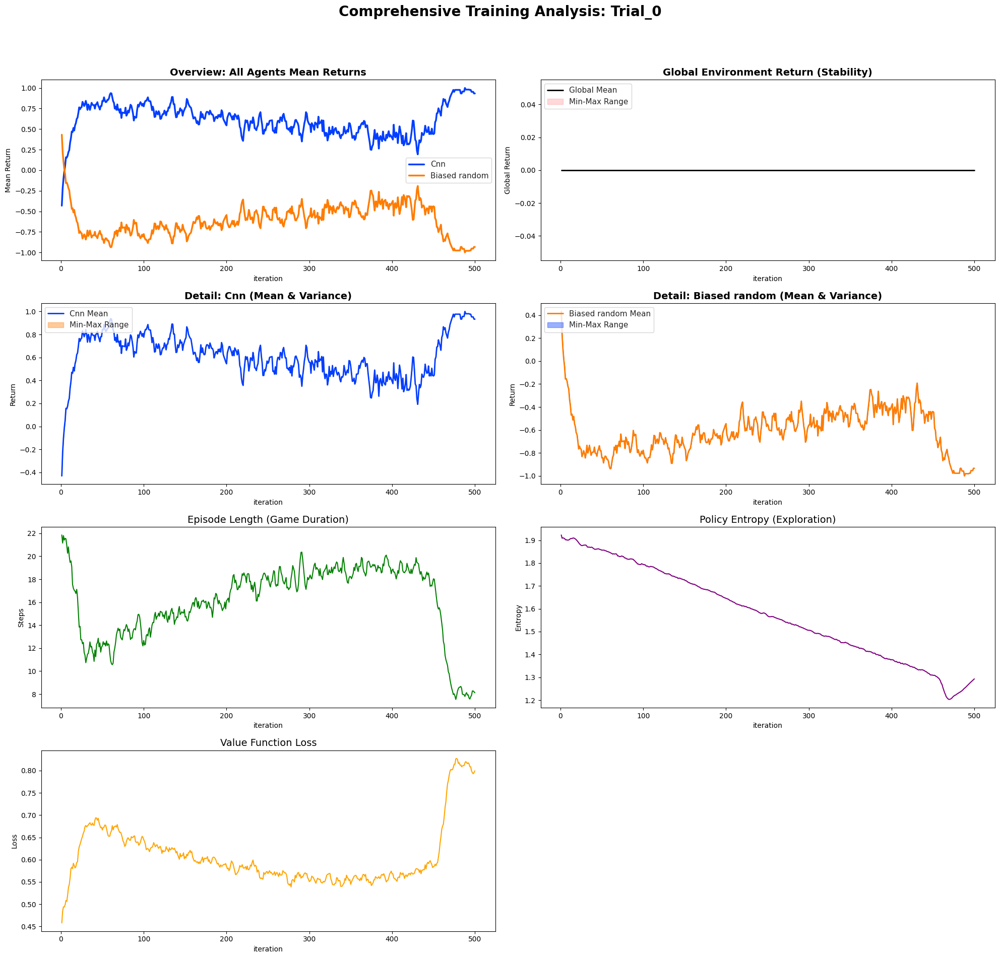
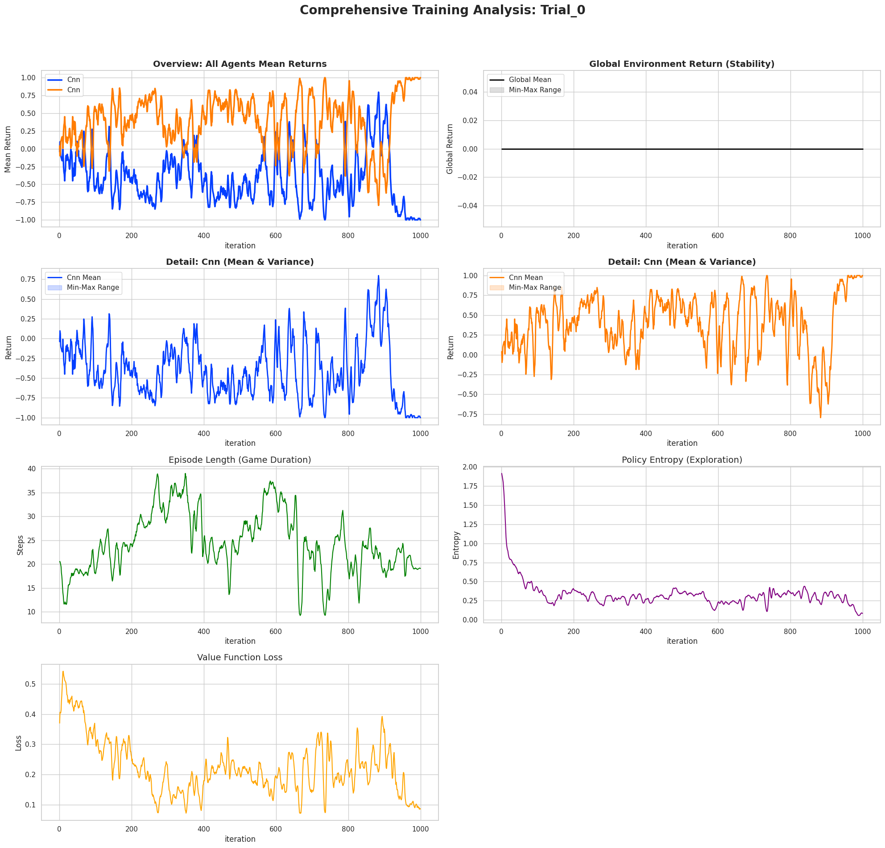

# Experiments Connect Four


## CNN vs Biased Random

### 1

```
python3 -O ./src/connect_four/train.py \
    --seed 42 \
    --mode cnn_vs_biased_random \
    --checkpoint-dir $checkpoint_dir \
    --iters 1000 \
    --save-interval 10 \
    --env-runners 6 \
    --num-envs-per-env-runner 20 \
    --num-cpus-per-env-runner 1 \
    --num-gpus-per-env-runner 0 \
    --lr 1e-4 \
    --gamma 0.995 \
    --clip-param 0.3 \
    --lambda 0.95 \
    --training-batch-size 5000 \
    --epochs 10 \
    --num-learners 1 \
    --num-gpus-per-learner 0.5 \
    --num-cpus-per-learner 1 \
    --entropy-coeff 0.01 \
    --minibatch-size 500
```

```py
{
    "custom_cnn": RLModuleSpec(
        module_class=Connect4CnnRLModule,
        model_config={
            "cnn_layers": [32, 64, 128],
        }
    ),
    "custom_biased_random": RLModuleSpec(
        module_class=BiasedRandomConnect4RLModule,
    ),
}
```



CNN wins most of the time, using simple strategy: stacking coins.


## CNN vs MLP

### 1

```
python3 -O ./src/connect_four/train.py \
    --seed 42 \
    --mode cnn_vs_mlp \
    --checkpoint-dir $checkpoint_dir \
    --iters 1000 \
    --save-interval 10 \
    --env-runners 6 \
    --num-envs-per-env-runner 20 \
    --num-cpus-per-env-runner 1 \
    --num-gpus-per-env-runner 0 \
    --lr 1e-4 \
    --gamma 0.995 \
    --clip-param 0.3 \
    --lambda 0.95 \
    --training-batch-size 5000 \
    --epochs 10 \
    --num-learners 1 \
    --num-gpus-per-learner 0.5 \
    --num-cpus-per-learner 1 \
    --entropy-coeff 0.01 \
    --minibatch-size 500
```

```py
rl_module_specs={
    "custom_cnn": RLModuleSpec(
        module_class=Connect4CnnRLModule,
        model_config={
            "cnn_layers": [32, 64, 128],
        }
    ),
    "custom_mlp": RLModuleSpec(
        module_class=Connect4MlpRLModule,
        model_config={
            "fcnet_hiddens": [256, 256],
        }
    ),
}
```



Sometimes easy victories are ignored


### 2

```
python3 -O ./src/connect_four/train.py \
    --seed 42 \
    --mode cnn_vs_mlp \
    --checkpoint-dir $checkpoint_dir \
    --iters 1000 \
    --save-interval 10 \
    --env-runners 6 \
    --num-envs-per-env-runner 20 \
    --num-cpus-per-env-runner 1 \
    --num-gpus-per-env-runner 0 \
    --lr 1e-4 \
    --gamma 0.98 \
    --clip-param 0.3 \
    --lambda 0.95 \
    --training-batch-size 5000 \
    --epochs 10 \
    --num-learners 1 \
    --num-gpus-per-learner 0.5 \
    --num-cpus-per-learner 1 \
    --entropy-coeff 0.01 \
    --minibatch-size 500
```

```py
rl_module_specs={
    "custom_cnn": RLModuleSpec(
        module_class=Connect4CnnRLModule,
        model_config={
            "cnn_layers": [32, 64, 128],
        }
    ),
    "custom_mlp": RLModuleSpec(
        module_class=Connect4MlpRLModule,
        model_config={
            "fcnet_hiddens": [256, 256],
        }
    ),
}
```




## Shared CNN

### 1

```
python3 -O ./src/connect_four/train.py \
    --seed 42 \
    --mode shared_cnn \
    --checkpoint-dir $checkpoint_dir \
    --iters 1000 \
    --save-interval 10 \
    --env-runners 6 \
    --num-envs-per-env-runner 20 \
    --num-cpus-per-env-runner 1 \
    --num-gpus-per-env-runner 0 \
    --lr 1e-4 \
    --gamma 0.99 \
    --clip-param 0.3 \
    --lambda 0.95 \
    --training-batch-size 5000 \
    --epochs 10 \
    --num-learners 1 \
    --num-gpus-per-learner 0.5 \
    --num-cpus-per-learner 1 \
    --entropy-coeff 0.01 \
    --minibatch-size 500
```



Win is more important than block opponent's win, maybe due to wrong strategy: 1v1 real-time instead of freezed version.

## Shared CNNv2

```
python3 -O ./src/connect_four/train.py \
    --seed 42 \
    --mode shared_cnn \
    --checkpoint-dir $checkpoint_dir \
    --iters 500 \
    --save-interval 10 \
    --env-runners 6 \
    --num-envs-per-env-runner 20 \
    --num-cpus-per-env-runner 1 \
    --num-gpus-per-env-runner 0 \
    --lr 1e-4 \
    --gamma 0.9999 \
    --clip-param 0.3 \
    --lambda 0.95 \
    --training-batch-size 5000 \
    --epochs 10 \
    --num-learners 1 \
    --num-gpus-per-learner 0.5 \
    --num-cpus-per-learner 1 \
    --entropy-coeff 0.01 \
    --minibatch-size 500
```

