# Experiments DSSE search with random initial positions

## CNN-MLP Fusion Module 

### 1

```py
 reward_scheme = Reward(
        default=-0.1,
        leave_grid=-1,
        exceed_timestep=-5,
        drones_collision=-0.2,
        search_cell=0,
        search_and_find=10,
        proximity_threshold=0.05,
    )
```

```
python3 -O ./src/dsse_search/random/train.py \
    --seed 42 \
    --mode shared \
    --checkpoint-dir $checkpoint_dir \
    --iters 1000 \
    --save-interval 10 \
    --env-runners 6 \
    --num-envs-per-env-runner 10 \
    --num-cpus-per-env-runner 1 \
    --num-gpus-per-env-runner 0 \
    --lr 5e-5 \
    --gamma 0.98 \
    --clip-param 0.3 \
    --lambda 0.95 \
    --training-batch-size 8192 \
    --minibatch-size 1024 \
    --epochs 10 \
    --num-learners 1 \
    --num-gpus-per-learner 0.5 \
    --num-cpus-per-learner 1 \
    --entropy-coeff 0.02 \
    --probability-matrix-cnn-conv2d 1 16 32 64 \
    --probability-matrix-cnn-kernel-sizes 3 3 3 3 \
    --probability-matrix-cnn-strides 2 2 2 2 \
    --probability-matrix-cnn-paddings 1 1 1 1 \
    --drone-coordinates-mlp-hiddens 6 4 \
    --drone-coordinates-mlp-dropout 0.0 \
    --fusion-mlp-hiddens 64 32 \
    --fusion-mlp-dropout 0.0 \
    --grid-size 40 \
    --timestep-limit 100 \
    --person-amount 1 \
    --dispersion-inc 0.1 \
    --drone-amount 3 \
    --drone-speed 10 \
    --detection-probability 0.9
```


### 2

```
reward_scheme = Reward(
        default=-0.1,
        leave_grid=0,
        exceed_timestep=0,
        drones_collision=0,
        search_cell=0,
        search_and_find=20,
        proximity_threshold=0.15,
    )
```

```
python3 -O ./src/dsse_search/random/train.py \
    --seed 42 \
    --mode shared \
    --checkpoint-dir $checkpoint_dir \
    --iters 500 \
    --save-interval 10 \
    --env-runners 6 \
    --num-envs-per-env-runner 10 \
    --num-cpus-per-env-runner 1 \
    --num-gpus-per-env-runner 0 \
    --lr 5e-5 \
    --gamma 0.98 \
    --clip-param 0.3 \
    --lambda 0.95 \
    --training-batch-size 8192 \
    --minibatch-size 1024 \
    --epochs 10 \
    --num-learners 1 \
    --num-gpus-per-learner 0.5 \
    --num-cpus-per-learner 1 \
    --entropy-coeff 0.02 \
    --probability-matrix-cnn-conv2d 1 16 32 64 \
    --probability-matrix-cnn-kernel-sizes 3 3 3 3 \
    --probability-matrix-cnn-strides 2 2 2 2 \
    --probability-matrix-cnn-paddings 1 1 1 1 \
    --drone-coordinates-mlp-hiddens 6 4 \
    --drone-coordinates-mlp-dropout 0.0 \
    --fusion-mlp-hiddens 64 32 \
    --fusion-mlp-dropout 0.0 \
    --grid-size 40 \
    --timestep-limit 100 \
    --person-amount 1 \
    --dispersion-inc 0.1 \
    --drone-amount 3 \
    --drone-speed 10 \
    --detection-probability 0.9
```

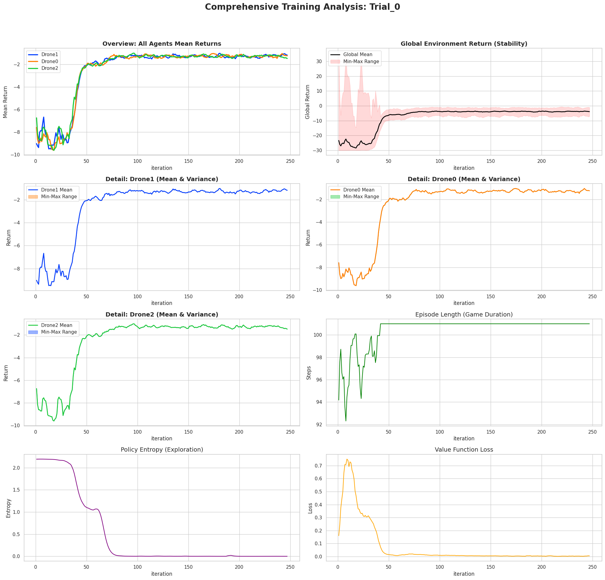

Better exit from grid (0) then negative reward (-0.1)


### 3

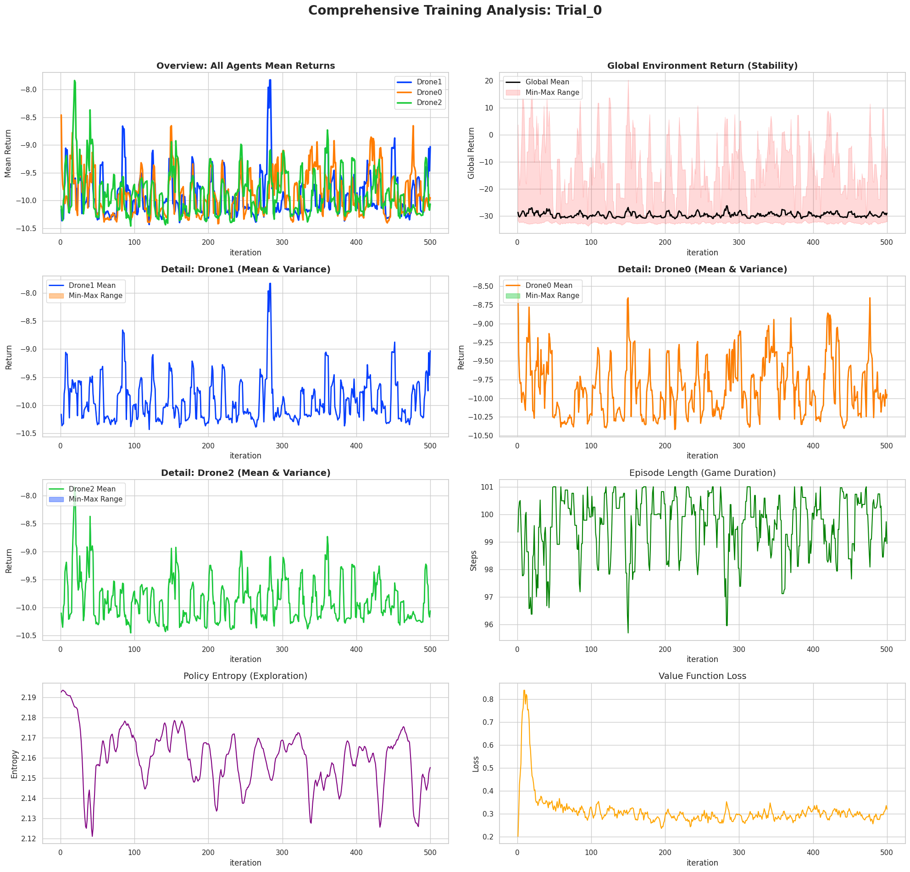

Sparse reward


### 4

```
python3 -O ./src/dsse_search/random/train.py \
    --seed 42 \
    --mode shared \
    --checkpoint-dir $checkpoint_dir \
    --iters 500 \
    --save-interval 10 \
    --env-runners 6 \
    --num-envs-per-env-runner 10 \
    --num-cpus-per-env-runner 1 \
    --num-gpus-per-env-runner 0 \
    --lr 1e-4 \
    --gamma 0.99 \
    --clip-param 0.3 \
    --lambda 0.95 \
    --training-batch-size 8192 \
    --minibatch-size 1024 \
    --epochs 10 \
    --num-learners 1 \
    --num-gpus-per-learner 0.5 \
    --num-cpus-per-learner 1 \
    --entropy-coeff 0.01 \
    --probability-matrix-cnn-conv2d 1 16 32 \
    --probability-matrix-cnn-kernel-sizes 3 3 3 \
    --probability-matrix-cnn-strides 2 2 2 \
    --probability-matrix-cnn-paddings 1 1 1 \
    --drone-coordinates-mlp-hiddens 6 4 \
    --drone-coordinates-mlp-dropout 0.0 \
    --fusion-mlp-hiddens 64 32 \
    --fusion-mlp-dropout 0.0 \
    --grid-size 40 \
    --timestep-limit 100 \
    --person-amount 1 \
    --dispersion-inc 0.1 \
    --drone-amount 3 \
    --drone-speed 10 \
    --detection-probability 0.9
```

```
reward_scheme = Reward(
        default=-0.1,
        leave_grid=-0.2,
        exceed_timestep=0,
        drones_collision=0,
        search_cell=0,
        search_and_find=20,
        proximity_threshold=0.01,
    )
```

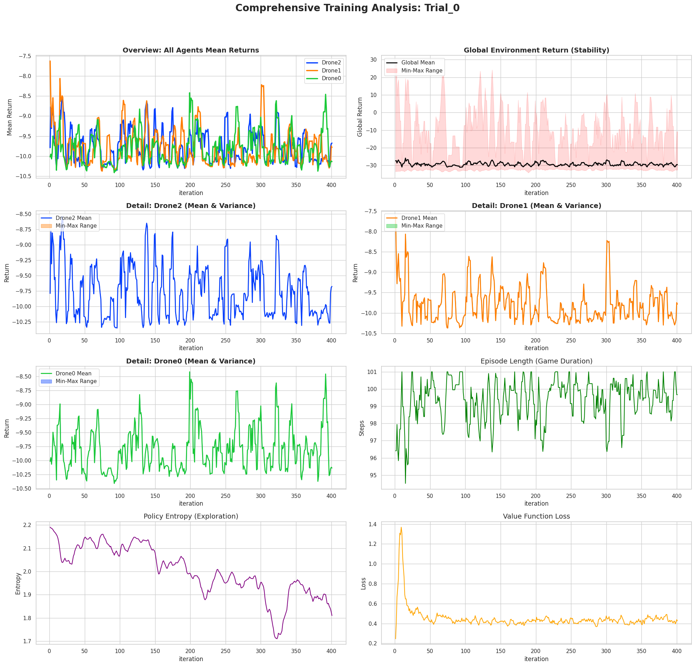


## MLP

### 1

`bf61c5d7bc0a3f5e4d5eea7ba439f90a51faf09f`

```
reward_scheme = Reward(
        default=-0.1,
        leave_grid=-0.2,
        exceed_timestep=0,
        drones_collision=0,
        search_cell=0,
        search_and_find=20,
        proximity_threshold=0,
    )
```


```
python3 -O ./src/dsse_search/random/train.py \
    --seed 42 \
    --mode shared_mlp \
    --checkpoint-dir $checkpoint_dir \
    --iters 300 \
    --save-interval 10 \
    --env-runners 6 \
    --num-envs-per-env-runner 10 \
    --num-cpus-per-env-runner 1 \
    --num-gpus-per-env-runner 0 \
    --lr 1e-4 \
    --gamma 0.99 \
    --clip-param 0.3 \
    --lambda 0.95 \
    --training-batch-size 8192 \
    --minibatch-size 1024 \
    --epochs 10 \
    --num-learners 1 \
    --num-gpus-per-learner 0.5 \
    --num-cpus-per-learner 1 \
    --entropy-coeff 0.01 \
    --grid-size 40 \
    --timestep-limit 100 \
    --person-amount 1 \
    --dispersion-inc 0.1 \
    --drone-amount 3 \
    --drone-speed 10 \
    --detection-probability 1
```

```
model_config={
    "mlp_hiddens": [256, 128],
    "mlp_dropout": 0,
}   
```

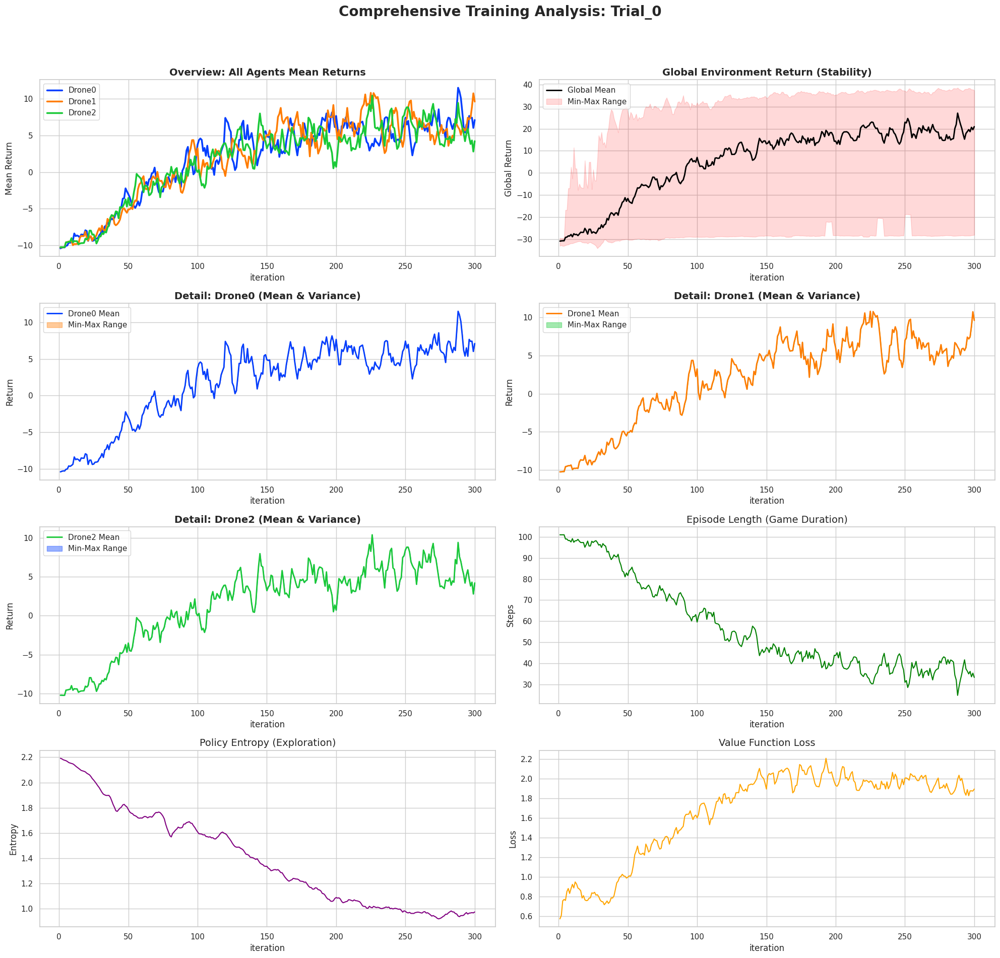


### 2


```
python3 -O ./src/dsse_search/random/train.py \
    --seed 42 \
    --mode shared_mlp \
    --checkpoint-dir $checkpoint_dir \
    --iters 1000 \
    --save-interval 10 \
    --env-runners 6 \
    --num-envs-per-env-runner 10 \
    --num-cpus-per-env-runner 1 \
    --num-gpus-per-env-runner 0 \
    --lr 1e-4 \
    --gamma 0.99 \
    --clip-param 0.3 \
    --lambda 0.95 \
    --training-batch-size 8192 \
    --minibatch-size 1024 \
    --epochs 10 \
    --num-learners 1 \
    --num-gpus-per-learner 0.5 \
    --num-cpus-per-learner 1 \
    --entropy-coeff 0.01 \
    --grid-size 40 \
    --timestep-limit 100 \
    --person-amount 1 \
    --dispersion-inc 0.1 \
    --drone-amount 3 \
    --drone-speed 10 \
    --detection-probability 1
```

```
reward_scheme = Reward(
        default=-0.2,
        leave_grid=-0.4,
        exceed_timestep=0,
        drones_collision=0,
        search_cell=0,
        search_and_find=30,
        proximity_threshold=0,
    )
```

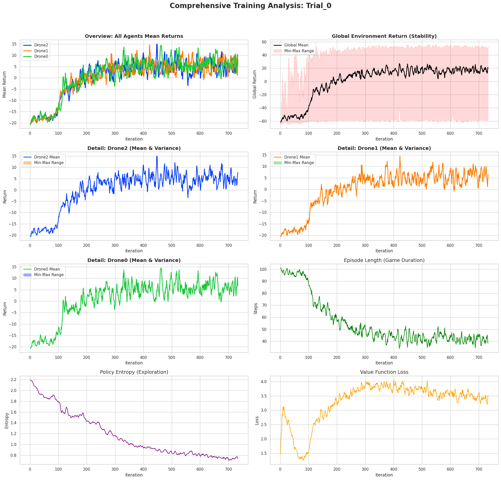


### 3

```
python3 -O ./src/dsse_search/random/train.py \
    --seed 42 \
    --mode shared_mlp \
    --checkpoint-dir $checkpoint_dir \
    --iters 1000 \
    --save-interval 10 \
    --env-runners 6 \
    --num-envs-per-env-runner 10 \
    --num-cpus-per-env-runner 1 \
    --num-gpus-per-env-runner 0 \
    --lr 1e-4 \
    --gamma 0.99 \
    --clip-param 0.3 \
    --lambda 0.95 \
    --training-batch-size 8192 \
    --minibatch-size 1024 \
    --epochs 10 \
    --num-learners 1 \
    --num-gpus-per-learner 0.5 \
    --num-cpus-per-learner 1 \
    --entropy-coeff 0.01 \
    --grid-size 40 \
    --timestep-limit 100 \
    --person-amount 1 \
    --dispersion-inc 0.1 \
    --drone-amount 3 \
    --drone-speed 10 \
    --detection-probability 1
```

```
reward_scheme = Reward(
    default=-0.15,
    leave_grid=-0.5,
    exceed_timestep=0,
    drones_collision=0,
    search_cell=0,
    search_and_find=40,
    proximity_threshold=0,
)
```


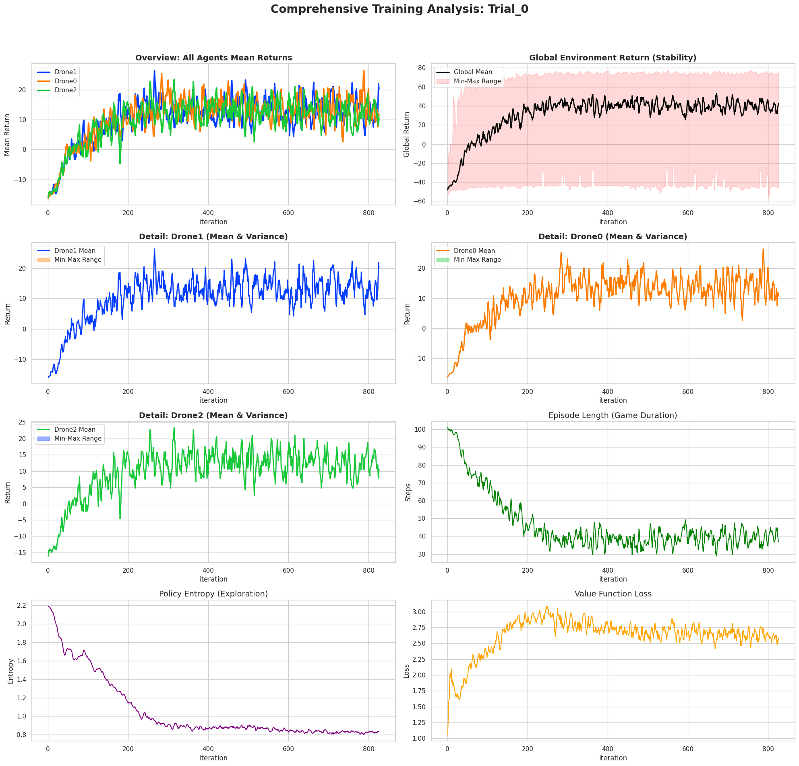


### 4

```
python3 -O ./src/dsse_search/random/train.py \
    --seed 42 \
    --mode shared_mlp \
    --checkpoint-dir $checkpoint_dir \
    --iters 1000 \
    --save-interval 10 \
    --env-runners 6 \
    --num-envs-per-env-runner 10 \
    --num-cpus-per-env-runner 1 \
    --num-gpus-per-env-runner 0 \
    --lr 1e-4 \
    --gamma 0.99 \
    --clip-param 0.3 \
    --lambda 0.95 \
    --training-batch-size 8192 \
    --minibatch-size 1024 \
    --epochs 10 \
    --num-learners 1 \
    --num-gpus-per-learner 0.5 \
    --num-cpus-per-learner 1 \
    --entropy-coeff 0.01 \
    --grid-size 40 \
    --timestep-limit 100 \
    --person-amount 1 \
    --dispersion-inc 0.1 \
    --drone-amount 3 \
    --drone-speed 10 \
    --detection-probability 1
```

```
reward_scheme = Reward(
        default=-0.15,
        leave_grid=-0.5,
        exceed_timestep=0,
        drones_collision=0,
        search_cell=0,
        search_and_find=40,
        proximity_threshold=0,
    )
```

```
model_config={
    "mlp_hiddens": [256, 128],
    "mlp_dropout": 0,
}
```

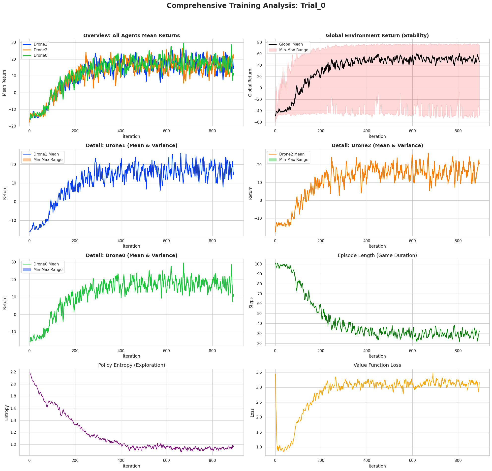


### 5

```
python3 -O ./src/dsse_search/random/train.py \
    --seed 42 \
    --mode shared_mlp \
    --checkpoint-dir $checkpoint_dir \
    --iters 1000 \
    --save-interval 10 \
    --env-runners 6 \
    --num-envs-per-env-runner 10 \
    --num-cpus-per-env-runner 1 \
    --num-gpus-per-env-runner 0 \
    --lr 1e-4 \
    --gamma 0.995 \
    --clip-param 0.3 \
    --lambda 0.95 \
    --training-batch-size 8192 \
    --minibatch-size 1024 \
    --epochs 10 \
    --num-learners 1 \
    --num-gpus-per-learner 0.5 \
    --num-cpus-per-learner 1 \
    --entropy-coeff 0.01 \
    --grid-size 40 \
    --timestep-limit 100 \
    --person-amount 1 \
    --dispersion-inc 0.1 \
    --drone-amount 3 \
    --drone-speed 10 \
    --detection-probability 1
```

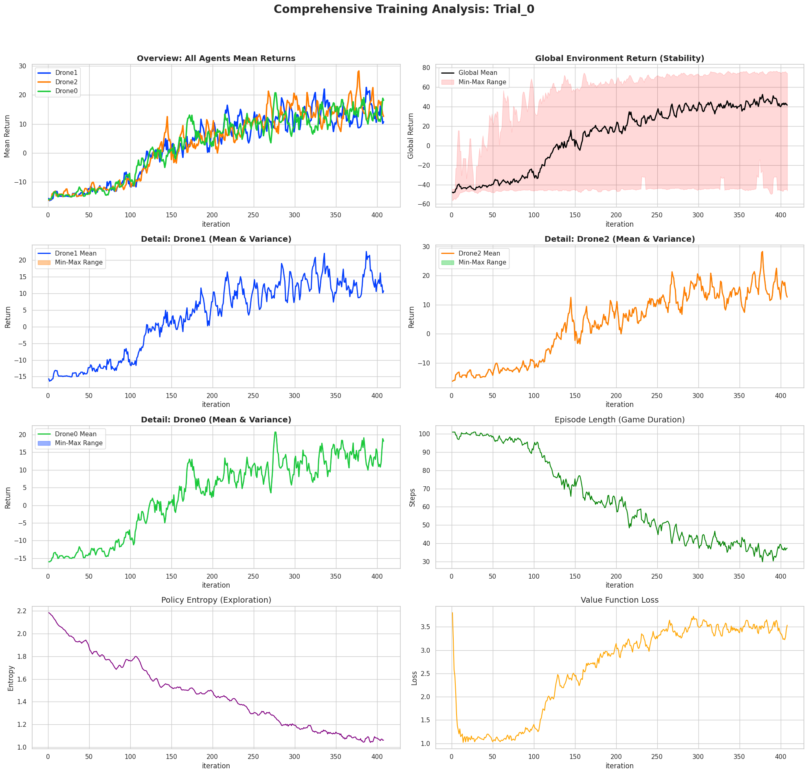

### 6

```
python3 -O ./src/dsse_search/random/train.py \
    --seed 42 \
    --mode shared_mlp \
    --checkpoint-dir $checkpoint_dir \
    --iters 1000 \
    --save-interval 10 \
    --env-runners 6 \
    --num-envs-per-env-runner 10 \
    --num-cpus-per-env-runner 1 \
    --num-gpus-per-env-runner 0 \
    --lr 1e-4 \
    --gamma 0.95 \
    --clip-param 0.3 \
    --lambda 0.95 \
    --training-batch-size 8192 \
    --minibatch-size 1024 \
    --epochs 10 \
    --num-learners 1 \
    --num-gpus-per-learner 0.5 \
    --num-cpus-per-learner 1 \
    --entropy-coeff 0.01 \
    --grid-size 40 \
    --timestep-limit 100 \
    --person-amount 1 \
    --dispersion-inc 0.1 \
    --drone-amount 3 \
    --drone-speed 10 \
    --detection-probability 1
```

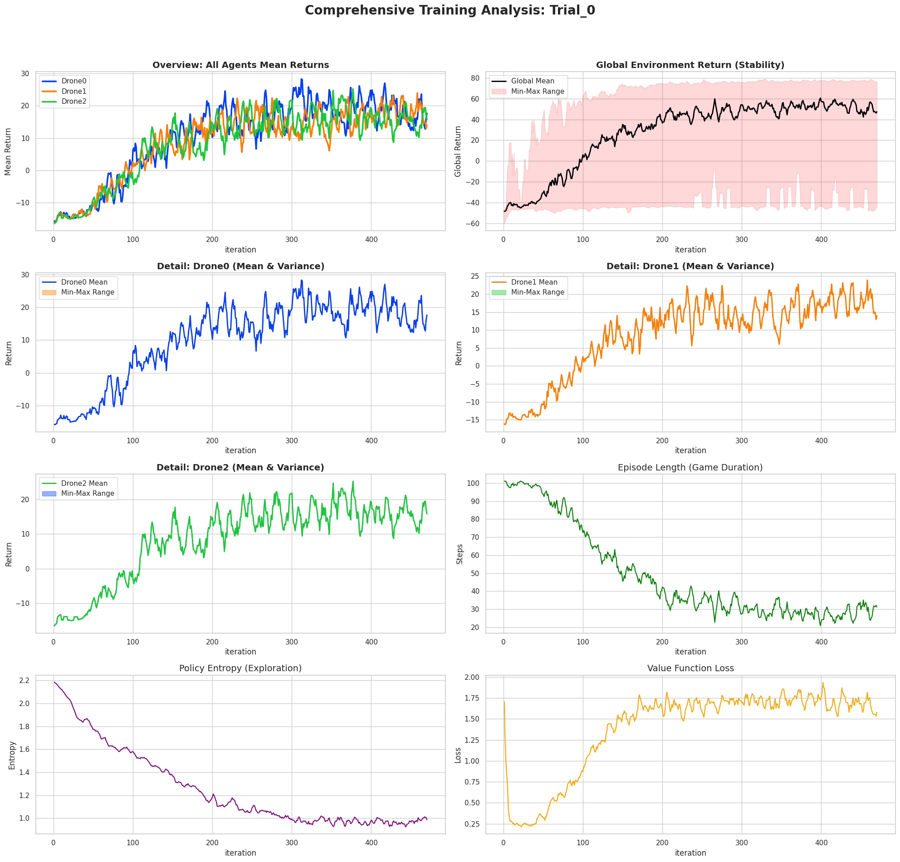


### 7

```
reward_scheme = Reward(
        default=-0.15,
        leave_grid=-0.5,
        exceed_timestep=0,
        drones_collision=0,
        search_cell=0,
        search_and_find=10,
        proximity_threshold=1,
    )
```

```
python3 -O ./src/dsse_search/random/train.py \
    --seed 42 \
    --mode shared_mlp \
    --checkpoint-dir $checkpoint_dir \
    --iters 1000 \
    --save-interval 10 \
    --env-runners 6 \
    --num-envs-per-env-runner 10 \
    --num-cpus-per-env-runner 1 \
    --num-gpus-per-env-runner 0 \
    --lr 1e-4 \
    --gamma 0.95 \
    --clip-param 0.3 \
    --lambda 0.95 \
    --training-batch-size 8192 \
    --minibatch-size 1024 \
    --epochs 10 \
    --num-learners 1 \
    --num-gpus-per-learner 0.5 \
    --num-cpus-per-learner 1 \
    --entropy-coeff 0.01 \
    --grid-size 40 \
    --timestep-limit 100 \
    --person-amount 1 \
    --dispersion-inc 0.1 \
    --drone-amount 3 \
    --drone-speed 10 \
    --detection-probability 1
```

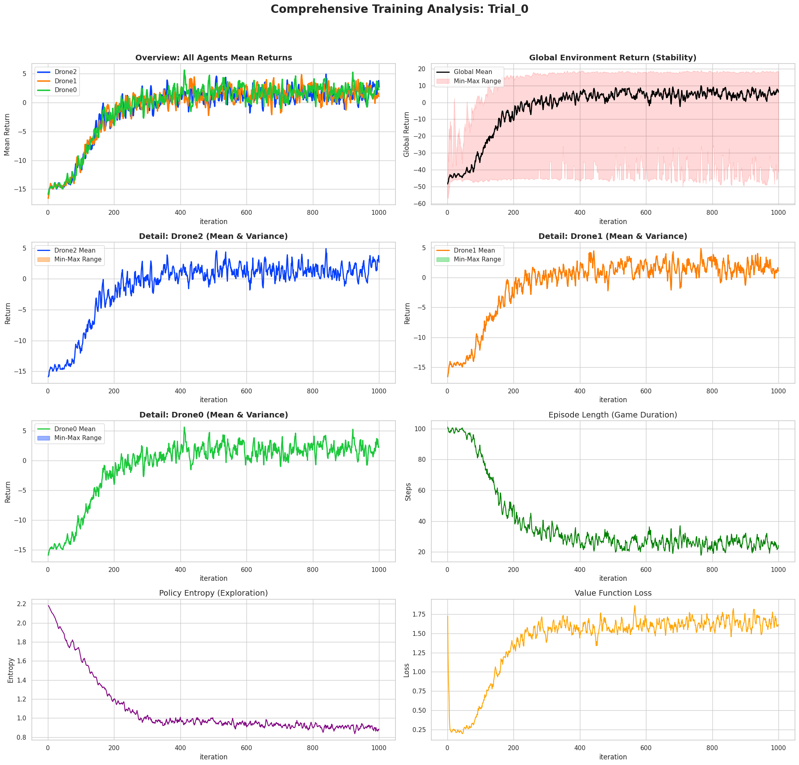

### 8

```
model_config={
    "mlp_hiddens": [32, 64, 64, 64, 32],
    "mlp_dropout": 0,
}
```

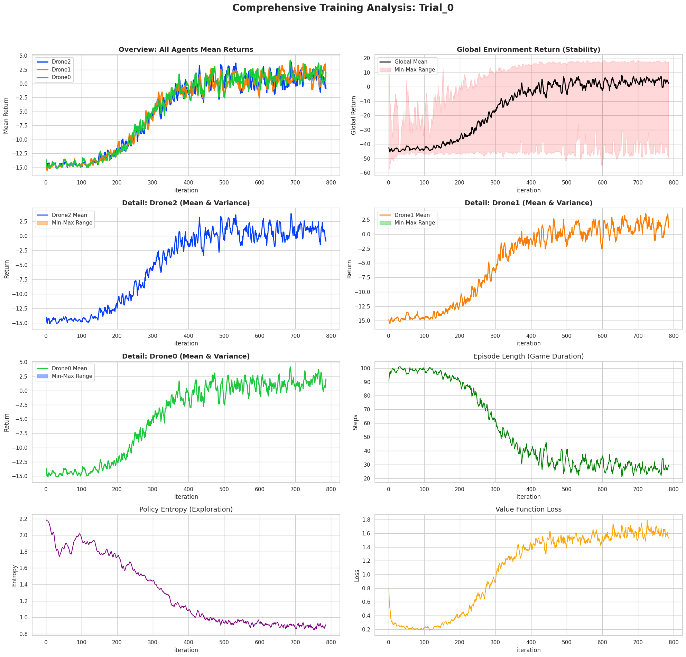


