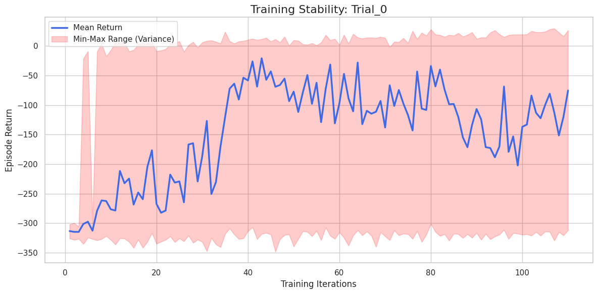
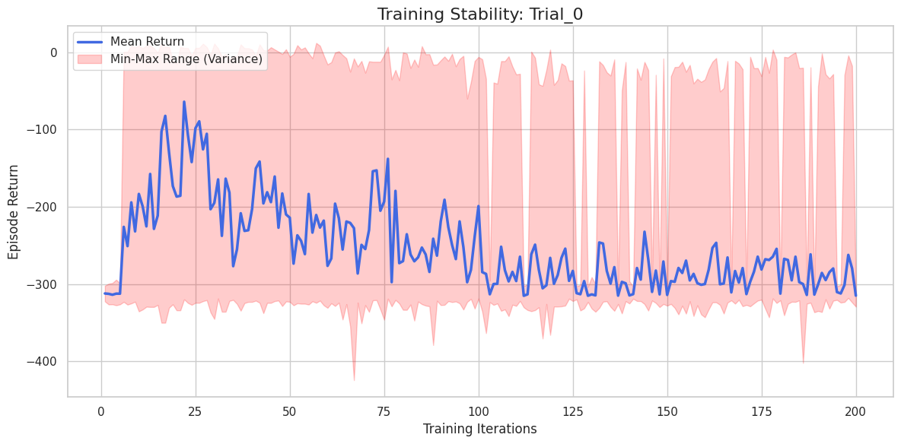

# Experiments Multiwalker

## 3 Walkers

### 1

```
python3 -O ./src/multiwalker/train.py \
    --mode shared \
    --checkpoint-dir $checkpoint_dir \
    --iters 500 \
    --save-interval 6 \
    --env-runners 12 \
    --num-envs-per-env-runner 20 \
    --num-cpus-per-env-runner 1 \
    --num-gpus-per-env-runner 0 \
    --lr 0.0003 \
    --gamma 0.99 \
    --training-batch-size 61440 \
    --epochs 10 \
    --num-learners 1 \
    --num-gpus-per-learner 0.5 \
    --num-cpus-per-learner 1 \
    --entropy-coeff 0.01 \
    --minibatch-size 4096 \
    --n-walkers 3
```



### 2

```
python3 -O ./src/multiwalker/train.py \
    --mode shared \
    --checkpoint-dir $checkpoint_dir \
    --iters 200 \
    --save-interval 10 \
    --env-runners 6 \
    --num-envs-per-env-runner 10 \
    --num-cpus-per-env-runner 1 \
    --num-gpus-per-env-runner 0 \
    --lr 0.0001 \
    --gamma 0.99 \
    --training-batch-size 15360 \
    --epochs 10 \
    --num-learners 1 \
    --num-gpus-per-learner 0.5 \
    --num-cpus-per-learner 1 \
    --entropy-coeff 0.01 \
    --minibatch-size 15360 \
    --n-walkers 3
```



Overfitting