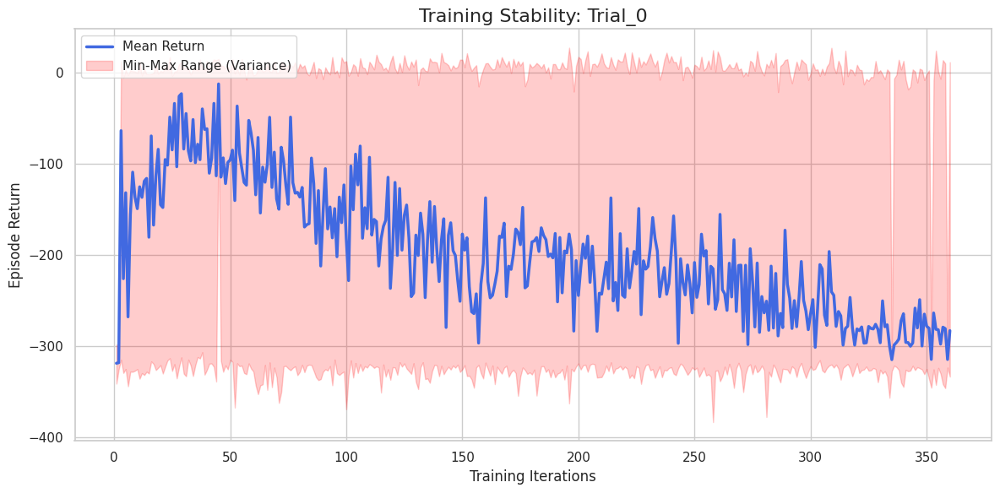
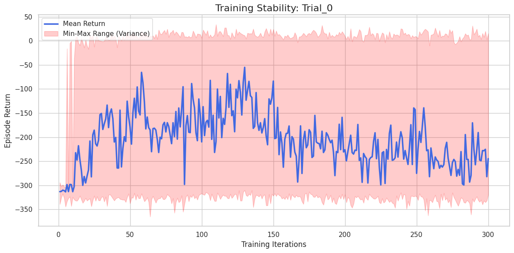
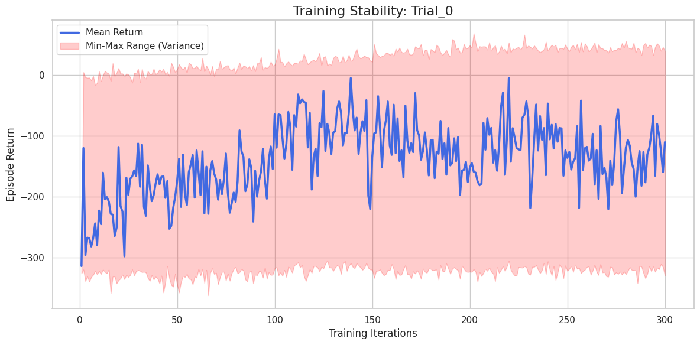
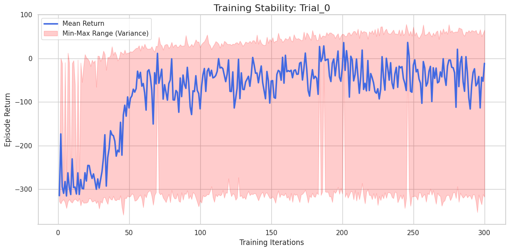
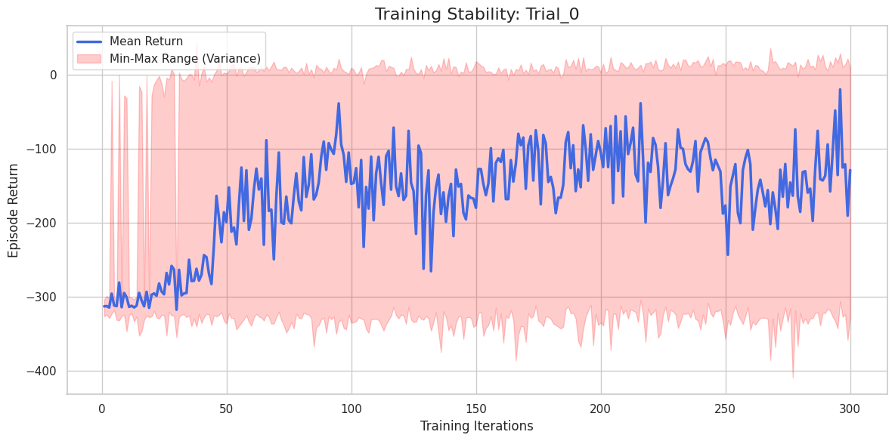
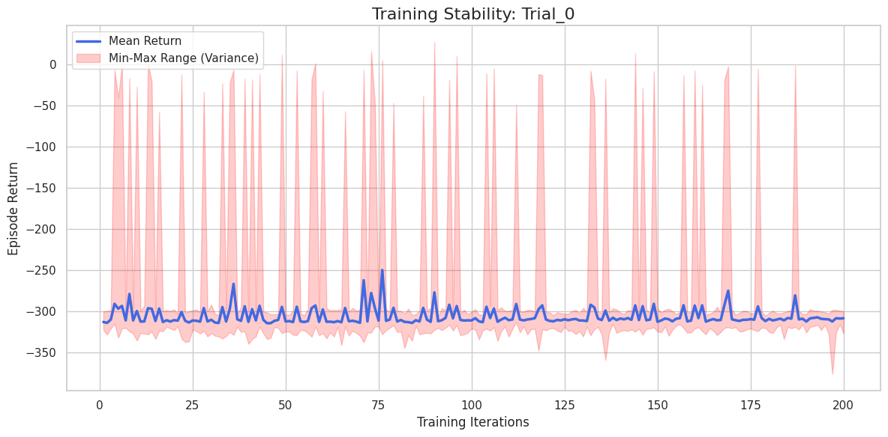
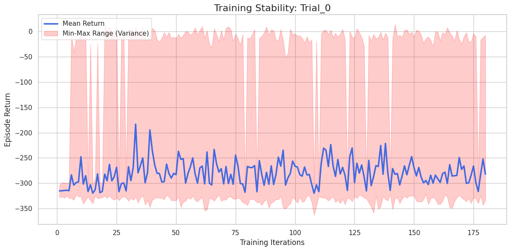

# Experiments Multiwalker

## 3 Walkers

### 1

```
python3 -O ./src/multiwalker/train.py \
    --mode shared \
    --checkpoint-dir $checkpoint_dir \
    --iters 500 \
    --save-interval 6 \
    --env-runners 12 \
    --num-envs-per-env-runner 20 \
    --num-cpus-per-env-runner 1 \
    --num-gpus-per-env-runner 0 \
    --lr 0.0003 \
    --gamma 0.99 \
    --training-batch-size 61440 \
    --epochs 10 \
    --num-learners 1 \
    --num-gpus-per-learner 0.5 \
    --num-cpus-per-learner 1 \
    --entropy-coeff 0.01 \
    --minibatch-size 4096 \
    --n-walkers 3
```


### 2

```
python3 -O ./src/multiwalker/train.py \
    --mode shared \
    --checkpoint-dir $checkpoint_dir \
    --iters 200 \
    --save-interval 10 \
    --env-runners 6 \
    --num-envs-per-env-runner 10 \
    --num-cpus-per-env-runner 1 \
    --num-gpus-per-env-runner 0 \
    --lr 0.0001 \
    --gamma 0.99 \
    --training-batch-size 15360 \
    --epochs 10 \
    --num-learners 1 \
    --num-gpus-per-learner 0.5 \
    --num-cpus-per-learner 1 \
    --entropy-coeff 0.01 \
    --minibatch-size 15360 \
    --n-walkers 3
```


Overfitting


### 3

```
python3 -O ./src/multiwalker/train.py \
    --mode shared \
    --checkpoint-dir $checkpoint_dir \
    --iters 500 \
    --save-interval 10 \
    --env-runners 6 \
    --num-envs-per-env-runner 20 \
    --num-cpus-per-env-runner 1 \
    --num-gpus-per-env-runner 0 \
    --lr 0.0003 \
    --gamma 0.99 \
    --training-batch-size 61440 \
    --epochs 10 \
    --num-learners 1 \
    --num-gpus-per-learner 0.5 \
    --num-cpus-per-learner 1 \
    --entropy-coeff 0.01 \
    --minibatch-size 4096 \
    --n-walkers 3
```




Catastrophic Forgetting


### 4

```
python3 -O ./src/multiwalker/train.py \
    --mode shared \
    --checkpoint-dir $checkpoint_dir \
    --iters 300 \
    --save-interval 10 \
    --env-runners 6 \
    --num-envs-per-env-runner 20 \
    --num-cpus-per-env-runner 1 \
    --num-gpus-per-env-runner 0 \
    --lr 0.0003 \
    --gamma 0.99 \
    --training-batch-size 30720 \
    --epochs 10 \
    --num-learners 1 \
    --num-gpus-per-learner 0.5 \
    --num-cpus-per-learner 1 \
    --entropy-coeff 0.005 \
    --minibatch-size 4096 \
    --n-walkers 3
```



### 5

```
python3 -O ./src/multiwalker/train.py \
    --mode shared \
    --checkpoint-dir $checkpoint_dir \
    --iters 300 \
    --save-interval 10 \
    --env-runners 6 \
    --num-envs-per-env-runner 20 \
    --num-cpus-per-env-runner 1 \
    --num-gpus-per-env-runner 0 \
    --lr 0.0003 \
    --gamma 0.99 \
    --training-batch-size 30720 \
    --epochs 10 \
    --num-learners 1 \
    --num-gpus-per-learner 0.5 \
    --num-cpus-per-learner 1 \
    --entropy-coeff 0.005 \
    --minibatch-size 4096 \
    --n-walkers 3
```

After iter 60:

```
python3 -O ./src/multiwalker/train.py \
    --mode shared \
    --checkpoint-dir $checkpoint_dir \
    --from-checkpoint $from_checkpoint \
    --iters 300 \
    --save-interval 10 \
    --env-runners 6 \
    --num-envs-per-env-runner 20 \
    --num-cpus-per-env-runner 1 \
    --num-gpus-per-env-runner 0 \
    --lr 0.00005 \
    --gamma 0.99 \
    --training-batch-size 30720 \
    --epochs 5 \
    --num-learners 1 \
    --num-gpus-per-learner 0.5 \
    --num-cpus-per-learner 1 \
    --entropy-coeff 0.005 \
    --minibatch-size 2048 \
    --n-walkers 3
```


### 6

Complex physic

```
model={
    "fcnet_hiddens": [256, 256],
    "fcnet_activation": "tanh",
    "vf_share_layers": False,
}
```

```
python3 -O ./src/multiwalker/train.py \
    --mode shared \
    --checkpoint-dir $checkpoint_dir \
    --iters 300 \
    --save-interval 10 \
    --env-runners 6 \
    --num-envs-per-env-runner 20 \
    --num-cpus-per-env-runner 1 \
    --num-gpus-per-env-runner 0 \
    --observation-filter MeanStdFilter \
    --lr 3e-4 \
    --gamma 0.99 \
    --clip-param 0.2 \
    --lambda 0.95 \
    --training-batch-size 30720 \
    --epochs 10 \
    --num-learners 1 \
    --num-gpus-per-learner 0.5 \
    --num-cpus-per-learner 1 \
    --entropy-coeff 0.01 \
    --minibatch-size 4096 \
    --parallel-env \
    --n-walkers 3
```




### 7

```
model={
    "fcnet_hiddens": [256, 256],
    "fcnet_activation": "tanh",
    "vf_share_layers": False,
}
```

```
python3 -O ./src/multiwalker/train.py \
    --mode shared \
    --checkpoint-dir $checkpoint_dir \
    --iters 300 \
    --save-interval 10 \
    --env-runners 6 \
    --num-envs-per-env-runner 20 \
    --num-cpus-per-env-runner 1 \
    --num-gpus-per-env-runner 0 \
    --stacked-frames 4 \
    --observation-filter MeanStdFilter \
    --lr 3e-4 \
    --gamma 0.99 \
    --clip-param 0.2 \
    --lambda 0.95 \
    --training-batch-size 30720 \
    --epochs 10 \
    --num-learners 1 \
    --num-gpus-per-learner 0.5 \
    --num-cpus-per-learner 1 \
    --entropy-coeff 0.01 \
    --minibatch-size 4096 \
    --parallel-env \
    --n-walkers 3
```




### 8

```
python3 -O ./src/multiwalker/train.py \
    --mode shared \
    --checkpoint-dir $checkpoint_dir \
    --iters 200 \
    --save-interval 10 \
    --env-runners 6 \
    --num-envs-per-env-runner 20 \
    --num-cpus-per-env-runner 1 \
    --num-gpus-per-env-runner 0 \
    --stacked-frames 4 \
    --observation-filter MeanStdFilter \
    --lr 3e-4 \
    --gamma 0.99 \
    --clip-param 0.2 \
    --lambda 0.95 \
    --training-batch-size 16384 \
    --epochs 10 \
    --num-learners 1 \
    --num-gpus-per-learner 0.5 \
    --num-cpus-per-learner 1 \
    --entropy-coeff 0.01 \
    --minibatch-size 1024 \
    --parallel-env \
    --n-walkers 3
```




### 9

```
python3 -O ./src/multiwalker/train.py \
    --mode shared \
    --checkpoint-dir $checkpoint_dir \
    --iters 300 \
    --save-interval 10 \
    --env-runners 6 \
    --num-envs-per-env-runner 20 \
    --num-cpus-per-env-runner 1 \
    --num-gpus-per-env-runner 0 \
    --stacked-frames 4 \
    --observation-filter MeanStdFilter \
    --lr 3e-4 \
    --gamma 0.99 \
    --clip-param 0.2 \
    --lambda 0.95 \
    --training-batch-size 16384 \
    --epochs 10 \
    --num-learners 1 \
    --num-gpus-per-learner 0.5 \
    --num-cpus-per-learner 1 \
    --entropy-coeff 0.015 \
    --minibatch-size 1024 \
    --parallel-env \
    --n-walkers 3
```




### 10

```
python3 -O ./src/multiwalker/train.py \
    --mode shared \
    --checkpoint-dir $checkpoint_dir \
    --iters 200 \
    --save-interval 10 \
    --env-runners 6 \
    --num-envs-per-env-runner 10 \
    --num-cpus-per-env-runner 1 \
    --num-gpus-per-env-runner 0 \
    --stacked-frames 4 \
    --observation-filter MeanStdFilter \
    --lr 5e-5 \
    --gamma 0.99 \
    --clip-param 0.1 \
    --lambda 0.95 \
    --training-batch-size 5000 \
    --epochs 10 \
    --num-learners 1 \
    --num-gpus-per-learner 0.5 \
    --num-cpus-per-learner 1 \
    --entropy-coeff 0.01 \
    --minibatch-size 500 \
    --parallel-env \
    --n-walkers 3
```




### 11

```
python3 -O ./src/multiwalker/train.py \
    --seed 42 \
    --mode shared \
    --checkpoint-dir $checkpoint_dir \
    --iters 200 \
    --save-interval 10 \
    --env-runners 6 \
    --num-envs-per-env-runner 20 \
    --num-cpus-per-env-runner 1 \
    --num-gpus-per-env-runner 0 \
    --stacked-frames 4 \
    --observation-filter MeanStdFilter \
    --fcnet-activation tanh \
    --fcnet-hiddens 400 300 \
    --lr 1e-4 \
    --gamma 0.995 \
    --clip-param 0.3 \
    --lambda 0.95 \
    --training-batch-size 50000 \
    --epochs 10 \
    --num-learners 1 \
    --num-gpus-per-learner 0.5 \
    --num-cpus-per-learner 1 \
    --entropy-coeff 0.01 \
    --minibatch-size 5000 \
    --kl-coeff 1.0 \
    --parallel-env \
    --n-walkers 3
```


