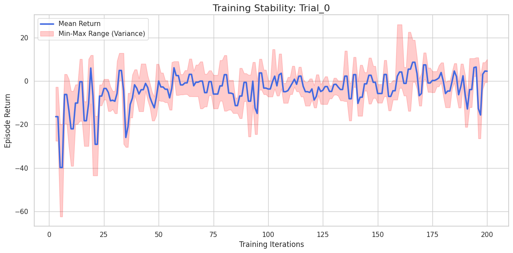

# Experiments Simple Adversary

## 2 Goods, 25 max cycles


### 1

```
python3 -O ./src/simple_adversary/train.py \
    --mode group_shared \
    --checkpoint-dir $checkpoint_dir \
    --iters 200 \
    --save-interval 10 \
    --env-runners 6 \
    --num-envs-per-env-runner 20 \
    --num-cpus-per-env-runner 1 \
    --num-gpus-per-env-runner 0 \
    --lr 0.0003 \
    --gamma 0.99 \
    --training-batch-size 4000 \
    --epochs 10 \
    --num-learners 1 \
    --num-gpus-per-learner 0.5 \
    --num-cpus-per-learner 1 \
    --entropy-coeff 0.01 \
    --minibatch-size 512 \
    --n-good-agents 2 \
    --max-cycles 25
```




Chart Analysis:

High Variance (Pink Area): The pink area is huge. This means that in some episodes the agents win easily, in others they lose disastrously. The policy is not robust.

Oscillation (Blue Line): The mean rises and falls. This happens because when the Adversary learns a strategy, the Good players get worse, then the Good players adapt, and the Adversary gets worse. It's a continuous chase (non-stationarity).

Low Return: The mean is still close to zero or negative, suggesting that the agents have not found a dominant strategy.

1. Normalizing Observations and Rewards (Crucial for PPO)

PPO struggles a lot when rewards or observations are not scaled (e.g., coordinates 0.5 vs. 100). In MPE, distances can vary greatly. We need to add a normalization filter.
2. Increasing the Neural Network's "Capacity"

RLlib's default configuration is often [256, 256], but for MPE, sometimes smaller networks with different activations or slightly deeper networks help capture complex spatial relationships (who is going to which landmark).
3. Tuning Clipping and KL Divergence

The instability suggests that policy updates are too aggressive. We can force PPO to take smaller, safer steps.