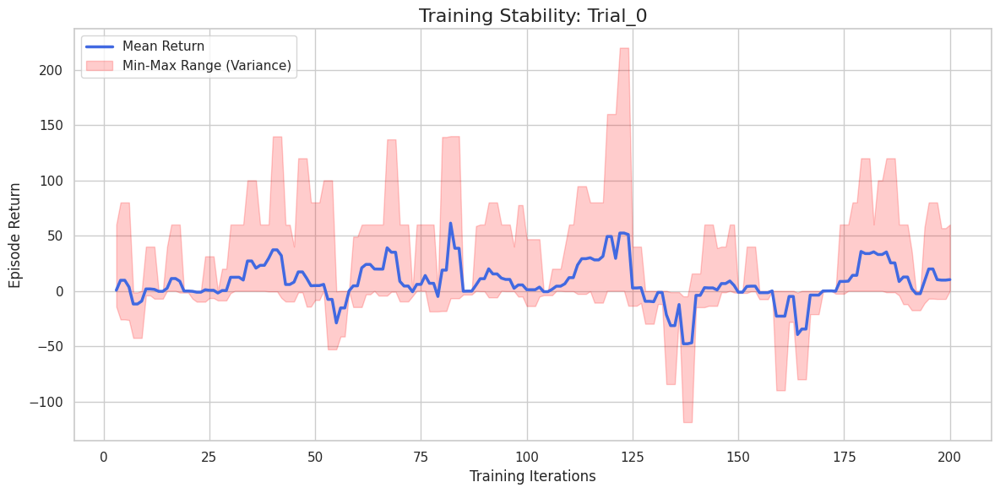
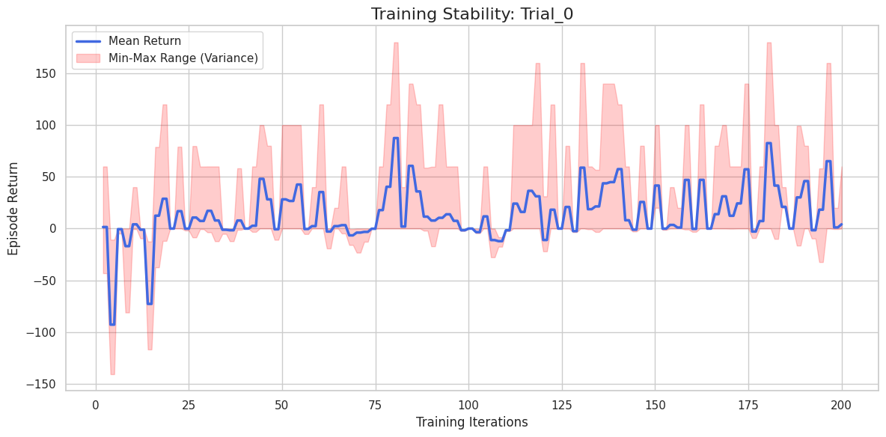
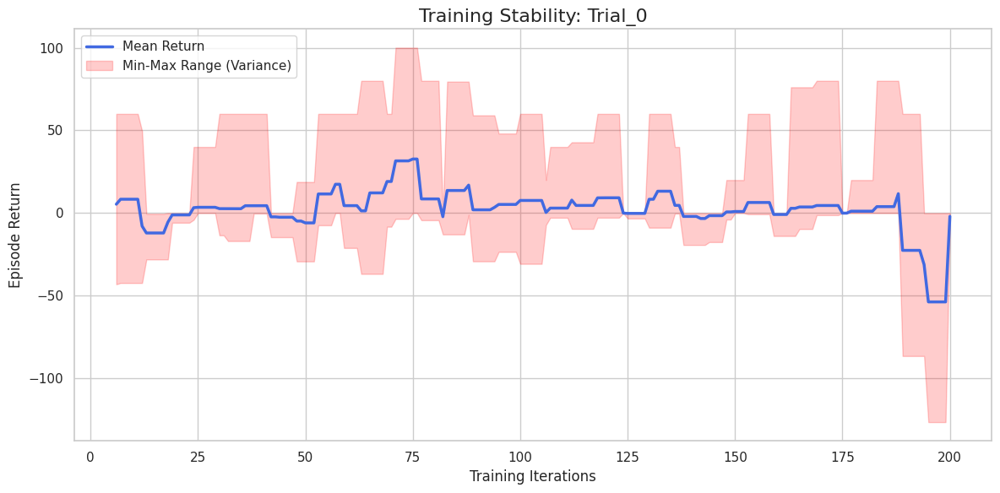

# Experiments MPE2 Simple Tag

## 1 Good, 3 Bads, 2 Obstacles, 25 max cycles

### 1

```
python3 -O ./src/simple_tag/train.py \
    --mode group_shared \
    --checkpoint-dir $checkpoint_dir \
    --iters 200 \
    --save-interval 10 \
    --env-runners 6 \
    --num-envs-per-env-runner 20 \
    --num-cpus-per-env-runner 1 \
    --num-gpus-per-env-runner 0 \
    --lr 0.0003 \
    --gamma 0.99 \
    --training-batch-size 4000 \
    --epochs 20 \
    --num-learners 1 \
    --num-gpus-per-learner 0.5 \
    --num-cpus-per-learner 1 \
    --entropy-coeff 0.01 \
    --minibatch-size 512 \
    --n-good-agents 1 \
    --n-bad-agents 3 \
    --n-obstacles 2 \
    --max-cycles 25
```



The mean rises and falls dramatically.

Typical scenario: Predators (adversaries) learn to catch prey -> Prey reward drops -> Prey learn to escape -> Predator reward drops.

This cycle continues indefinitely if the learning rate is too high or the batch size is too small, preventing convergence to a "Nash Equilibrium" (where no one can improve unilaterally).

Possible solutions:

- Force agents to learn general strategies, not momentary tricks
- more "statistics" for each update. With such a high variance, a small batch (e.g., 4,000 steps) might contain only lucky or unlucky episodes, leading to incorrect neural network updates
- The algorithm is making too large "jumps" in the policy. Reduce clip_param to 0.1 or 0.2 and increase num_sgd_iter (epochs) to squeeze more information from the collected data, but with smaller steps.
- Slightly wider networks to understand the pursuit dynamics


### 2

```
python3 -O ./src/simple_tag/train.py \
    --mode group_shared \
    --checkpoint-dir $checkpoint_dir \
    --iters 200 \
    --save-interval 10 \
    --env-runners 6 \
    --num-envs-per-env-runner 40 \
    --num-cpus-per-env-runner 1 \
    --num-gpus-per-env-runner 0 \
    --lr 0.0003 \
    --gamma 0.99 \
    --training-batch-size 4000 \
    --epochs 20 \
    --num-learners 1 \
    --num-gpus-per-learner 0.5 \
    --num-cpus-per-learner 1 \
    --entropy-coeff 0.01 \
    --minibatch-size 2048 \
    --n-good-agents 1 \
    --n-bad-agents 3 \
    --n-obstacles 2 \
    --max-cycles 25
```

```py
.training(
    model={
        "fcnet_hiddens": [256, 256],
        "fcnet_activation": "relu",
    }
)
```




### 3

Learning rate to 1e-4

```
python3 -O ./src/simple_tag/train.py \
    --mode group_shared \
    --checkpoint-dir $checkpoint_dir \
    --iters 200 \
    --save-interval 10 \
    --env-runners 6 \
    --num-envs-per-env-runner 40 \
    --num-cpus-per-env-runner 1 \
    --num-gpus-per-env-runner 0 \
    --lr 0.0001 \
    --gamma 0.99 \
    --training-batch-size 12000 \
    --epochs 20 \
    --num-learners 1 \
    --num-gpus-per-learner 0.5 \
    --num-cpus-per-learner 1 \
    --entropy-coeff 0.01 \
    --minibatch-size 2048 \
    --n-good-agents 1 \
    --n-bad-agents 3 \
    --n-obstacles 2 \
    --max-cycles 25
```

```py
.training(
    model={
        "fcnet_hiddens": [256, 256],
        "fcnet_activation": "tanh",
    }
)
```



